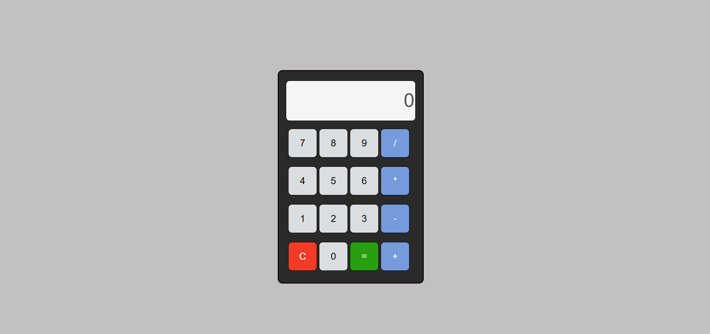

# Calculator Web Application

## Overview

This project is a simple Calculator built using HTML, CSS, and JavaScript. It performs basic arithmetic operations such as addition, subtraction, multiplication, and division through an interactive user interface.

## Features

* Addition (+)
* Subtraction (-)
* Multiplication (*)
* Division (/)
* Clear display button (C)
* Instant calculation using "=" button
* User-friendly interface
* Responsive button interactions with hover effects

## Technologies Used

* HTML5
* CSS3
* JavaScript

## Project Structure

```text
calculator-project/
│
├── index.html      # Main calculator page
├── style.css       # Calculator styling
├── script.js       # Calculator functionality
└── README.md       # Project documentation
```

## How It Works

### HTML

* Creates the calculator layout.
* Includes display screen and buttons.

### CSS

* Styles the calculator interface.
* Adds colors, spacing, hover effects, and alignment.

### JavaScript

* Handles button clicks.
* Updates the display.
* Clears the display.
* Evaluates mathematical expressions and shows results.

## Functions Used

### append(value)

Adds the selected number or operator to the display.

### clearDisplay()

Clears the current display value.

### calculate()

Evaluates the mathematical expression and displays the result.

## How to Run

1. Download or clone this repository.
2. Open the project folder.
3. Open `index.html` in your web browser.
4. Start performing calculations.

## Screenshot of website




## Future Improvements

* Add decimal point support.
* Add percentage (%) calculations.
* Add backspace/delete button.
* Support keyboard input.
* Improve responsiveness for mobile devices.
* Replace `eval()` with a safer calculation method.

## Author

Siri

Frontend Developer passionate about building interactive and user-friendly web applications using HTML, CSS, and JavaScript.
