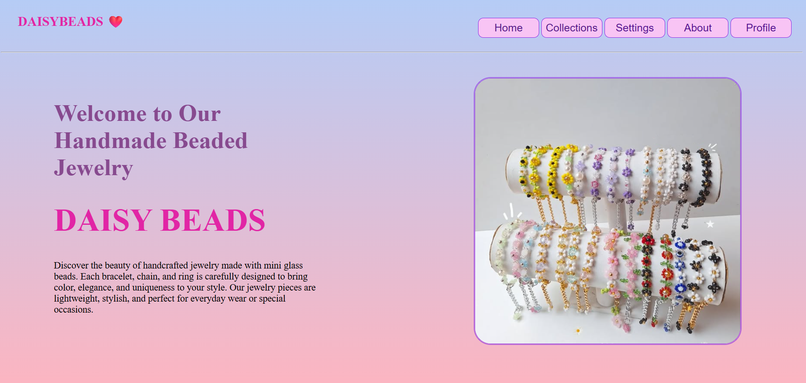
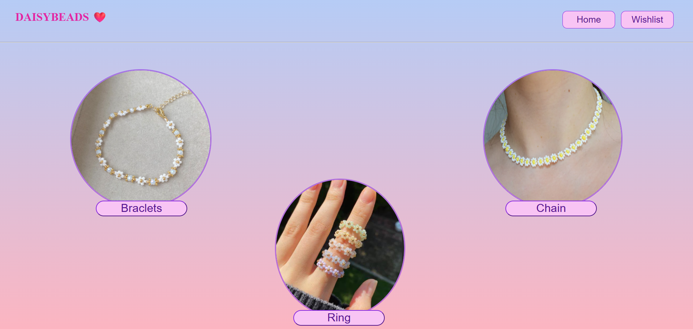

# DaisyBeads - Handmade Beaded Jewelry Website

## Overview

DaisyBeads is a simple and elegant jewelry website designed using HTML and CSS. The website showcases handmade beaded jewelry products such as bracelets, chains, and rings. It features a welcoming homepage and a collections page where users can browse different jewelry categories.

## Features

* Beautiful landing page
* Jewelry collections showcase
* Gradient background design
* Navigation menu
* Product images with stylish layouts
* Hover effects on buttons
* Separate Home and Collections pages
* Beginner-friendly project structure

## Technologies Used

* HTML5
* CSS3

## Project Structure

```text
DaisyBeads/
│
├── index.html          # Homepage
├── collections.html    # Collections page
├── style.css           # Website styling
├── jewl.jpg.png        # Homepage jewelry image
├── braclet.jpg.png     # Bracelet image
├── chain.jpg.png       # Chain image
├── ring.jpg.png        # Ring image
└── README.md           # Project documentation
```

## Website Pages

### Home Page

The homepage introduces visitors to DaisyBeads and includes:

* Brand logo and name
* Navigation menu
* Welcome message
* Introduction to handmade jewelry
* Featured jewelry image

### Collections Page

The collections page displays:

* Bracelets
* Chains
* Rings

Each collection is presented with an image and category button.

## Design Features

* Soft pastel color palette
* Gradient backgrounds
* Rounded image borders
* Stylish navigation buttons
* Hover effects for improved user experience

## How to Run

1. Download or clone the repository.
2. Place all image files in the project folder.
3. Open `index.html` in your web browser.
4. Navigate between pages using the menu buttons.

## Learning Outcomes

This project demonstrates:

* Multi-page website development
* HTML page linking
* CSS positioning
* CSS gradients
* Hover effects
* Image styling
* Basic website navigation

## Future Improvements

* Make the website fully responsive for mobile devices.
* Add product pricing.
* Add shopping cart functionality.
* Add wishlist functionality.
* Add contact page.
* Add product details page.
* Add JavaScript interactivity.
* Integrate an online payment system.

## Screenshot of homepage



## Screenshot of collections page



## Author

Siri

Frontend Developer passionate about creating beautiful and user-friendly websites using HTML, CSS, and JavaScript.

## Project Purpose

This project was created to practice frontend web development skills and demonstrate the design of a simple jewelry e-commerce website using only HTML and CSS.
