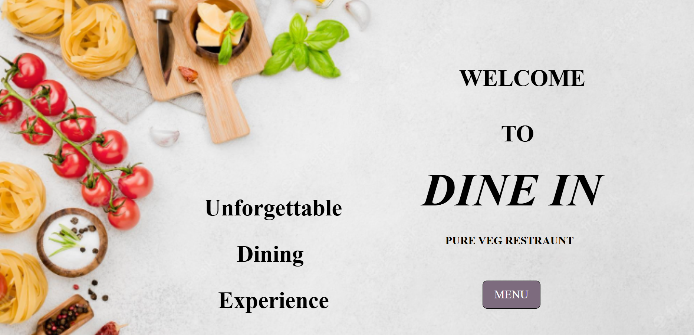
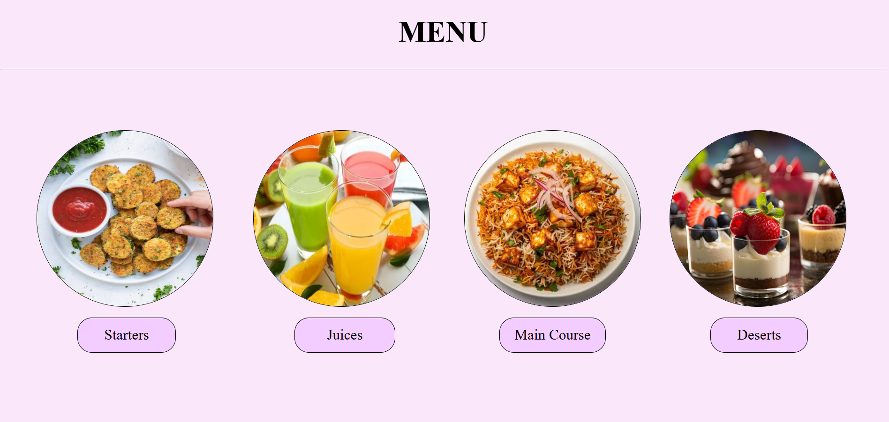
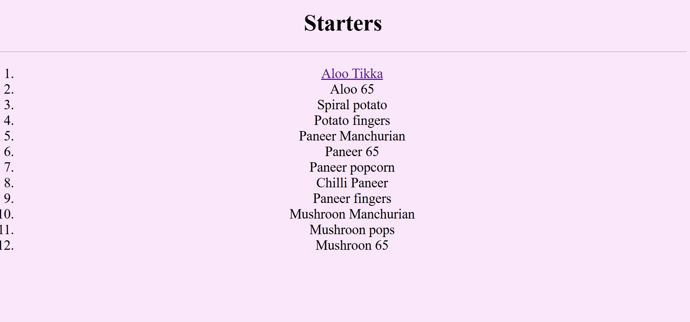
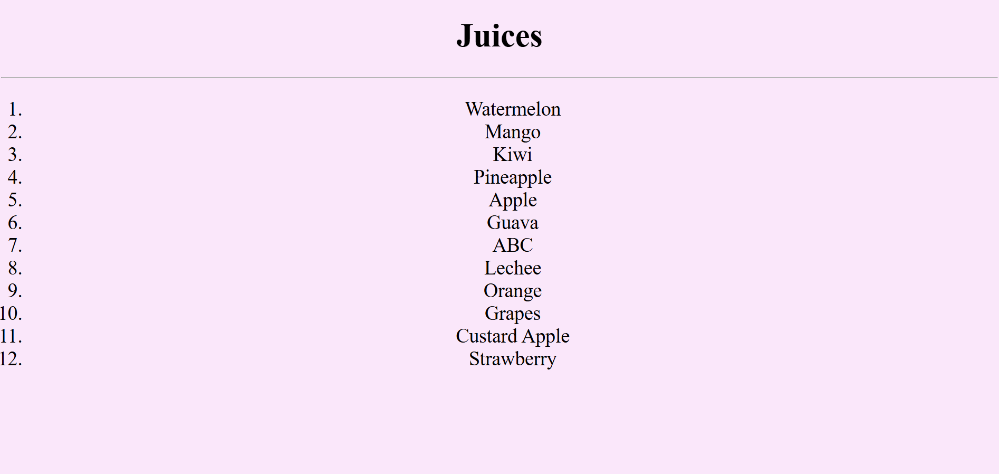
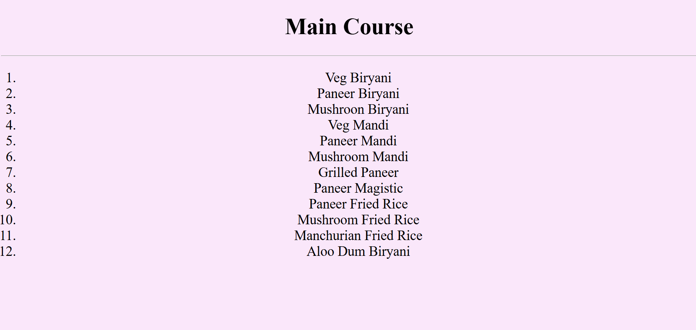
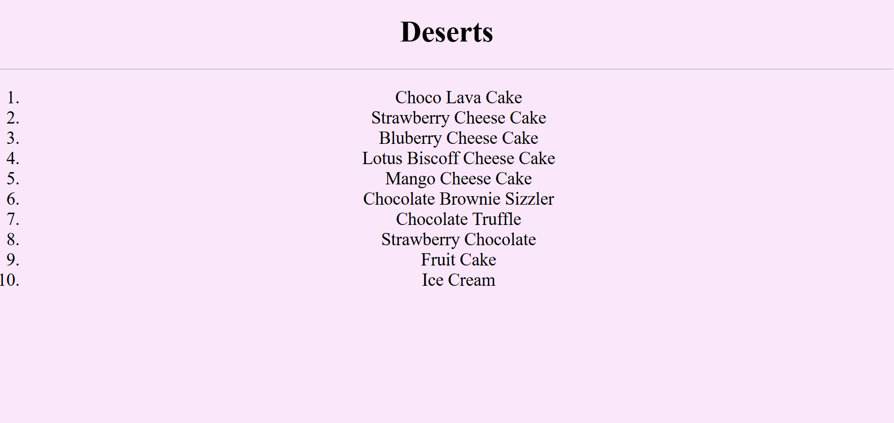

# Dine In - Pure Veg Restaurant Website

## Overview

Dine In is a multi-page restaurant website built using HTML and CSS. The website provides an attractive landing page and an organized menu system where customers can explore different food categories including Starters, Juices, Main Course, and Desserts.

The project focuses on frontend web development concepts such as page navigation, image-based layouts, CSS styling, and interactive hover effects.

## Features

* Attractive restaurant landing page
* Pure vegetarian restaurant theme
* Multi-page website navigation
* Food category menu system
* Interactive hover effects
* Image-based menu categories
* Clean and user-friendly interface

## Technologies Used

* HTML5
* CSS3

## Project Structure

```text
Dine-In-Restaurant/
│
├── index.html          # Landing page
├── page2.html          # Menu categories
├── page3.html          # Starters menu
├── page4.html          # Juices menu
├── page5.html          # Main Course menu
├── page6.html          # Desserts menu
├── style.css           # Website styling
│
├── bg.png              # Background image
├── starter.png         # Starters image
├── juice.png           # Juices image
├── biryani.png         # Main course image
├── desert.png          # Desserts image
│
└── README.md
```

## Website Pages

### Home Page

The landing page includes:

* Welcome message
* Restaurant branding
* Pure Veg Restaurant title
* "Unforgettable Dining Experience" slogan
* Menu navigation button

### Menu Categories Page

Customers can browse:

* Starters
* Juices
* Main Course
* Desserts

Each category is represented with an image and navigation button.

## User Interface Highlights

* Large hero section with restaurant branding
* Circular food category images
* Smooth hover effects on buttons
* Interactive menu items
* Simple navigation between pages

## How to Run

1. Download or clone the repository.
2. Place all required image files in the project folder.
3. Open `index.html` in your web browser.
4. Click the MENU button to explore food categories.

## Learning Outcomes

This project demonstrates:

* Multi-page website development
* Internal navigation using hyperlinks
* CSS positioning techniques
* Image styling and layouts
* Hover effects and user interactions
* Restaurant menu design concepts

## Future Improvements

* Add food prices
* Add food descriptions
* Make the website responsive for mobile devices
* Add restaurant contact page
* Add online ordering functionality
* Add reservation system
* Add customer reviews section
* Add image gallery
* Add JavaScript-powered interactions

## Screenshots

![Home Page]



![Menu Categories]



![Food Items]






## Author

Siri

Frontend Developer passionate about creating visually appealing and user-friendly websites using HTML, CSS, and JavaScript.

## Project Purpose

This project was created to practice frontend web development skills by building a restaurant website with multiple pages, attractive styling, and category-based menu navigation.
