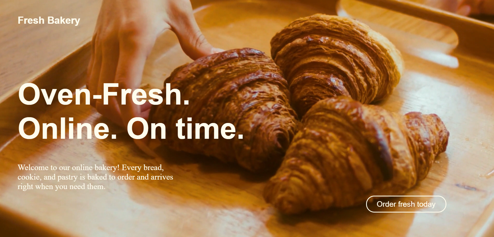
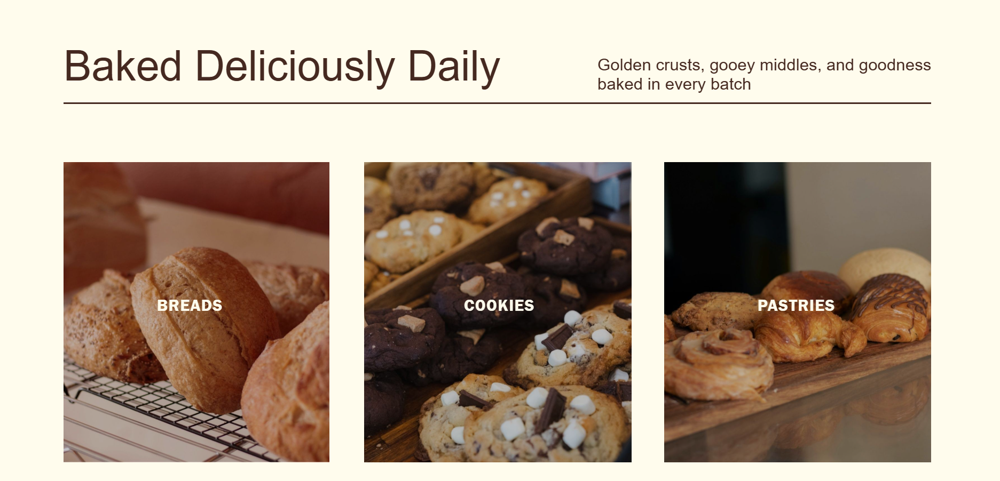
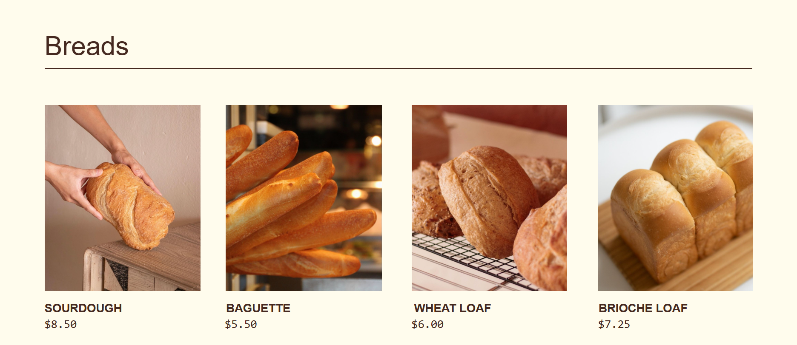
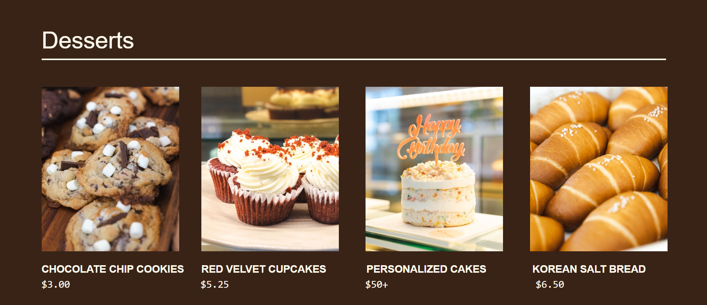
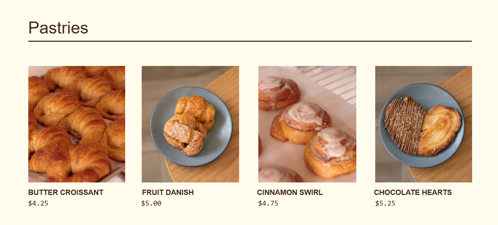
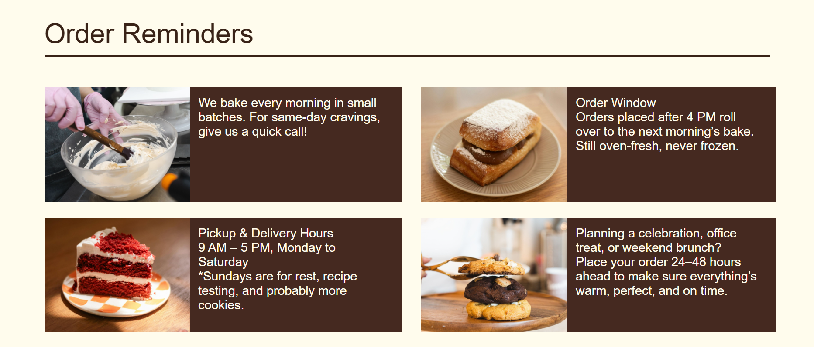
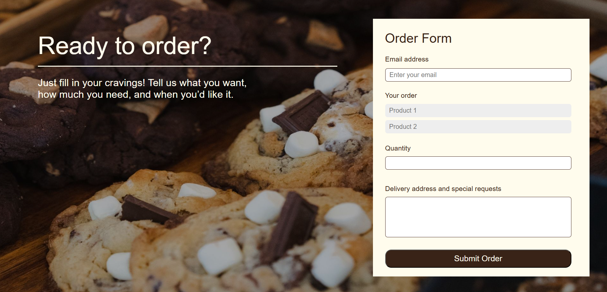
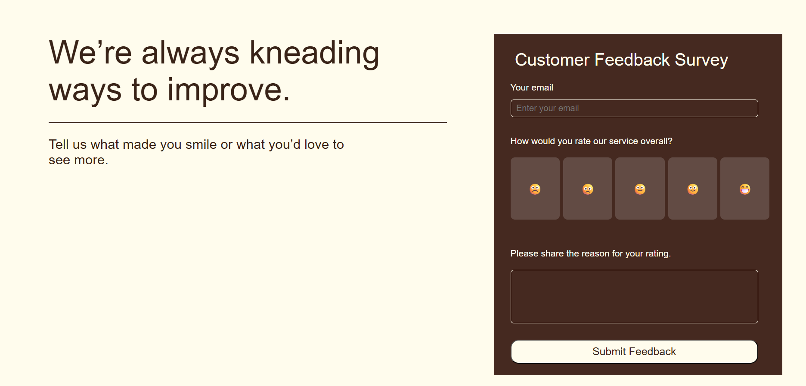
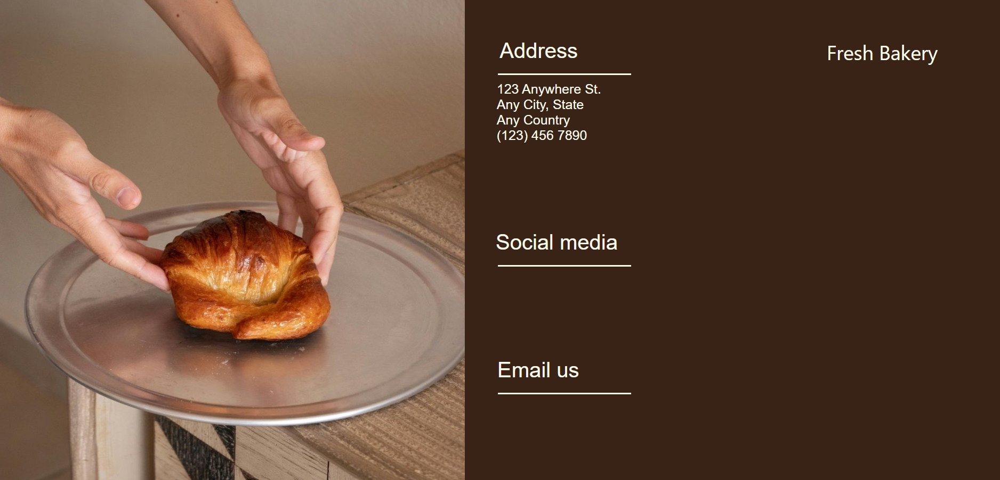

# 🥖 Fresh Bakery Website

A modern and visually appealing bakery website built using **HTML, CSS, and JavaScript**. The website showcases bakery products, allows customers to place orders, and collects customer feedback through interactive forms.

## 🌟 Features

* 🎥 Full-screen bakery video hero section
* 🍞 Product showcase for Breads, Desserts, and Pastries
* 📋 Order Reminder section with bakery policies
* 🛒 Customer Order Form
* ⭐ Customer Feedback Survey with rating emojis
* 🔔 JavaScript alert notifications for form submissions
* 🖼️ Interactive image hover effects
* 🎨 Elegant bakery-themed design and color palette
* 📱 Responsive viewport setup

## 🛠️ Technologies Used

* HTML5
* CSS3
* JavaScript

## 📂 Project Structure

```
FreshBakery/
│
├── index.html
├── page2.html
├── style.css
├── script.js
│
├── vid.mp4
│
├── 1.jpg
├── 2.jpg
├── 3.jpg
│
├── ...
│
└── 21.jpg
```

## 📄 Website Sections

### Home Section

* Background bakery video
* Bakery branding
* Call-to-action button

### Product Categories

* Breads
* Cookies
* Pastries

### Menu Section

* Bread Collection
* Dessert Collection
* Pastry Collection
* Product pricing

### Order Reminders

* Same-day order information
* Order window guidelines
* Pickup and delivery timings
* Advance booking recommendations

### Order Form

Customers can:

* Enter email address
* Select products
* Specify quantity
* Provide delivery details
* Submit orders

### Feedback Survey

Customers can:

* Rate service using emoji buttons
* Provide feedback comments
* Submit feedback

### Contact Section

* Bakery address
* Social media section
* Email section

## 💡 Future Improvements

* Form validation
* Shopping cart functionality
* Backend integration
* Database storage
* Email notifications
* Mobile responsiveness improvements
* Online payment gateway
* Social media links integration

## 📸 Preview

The website features:

* Bakery product galleries
* Interactive forms
* Smooth hover effects
* Warm bakery-inspired color scheme

## 👨‍💻 Author

Darshwana Allam

Created as a front-end web development project using HTML, CSS, and JavaScript.

## Screenshots of website









