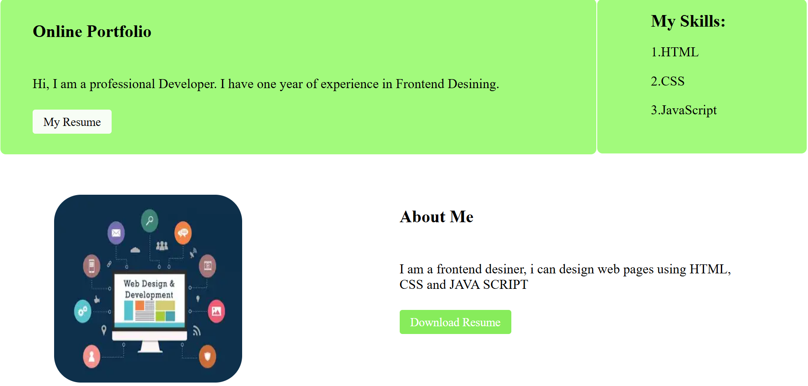
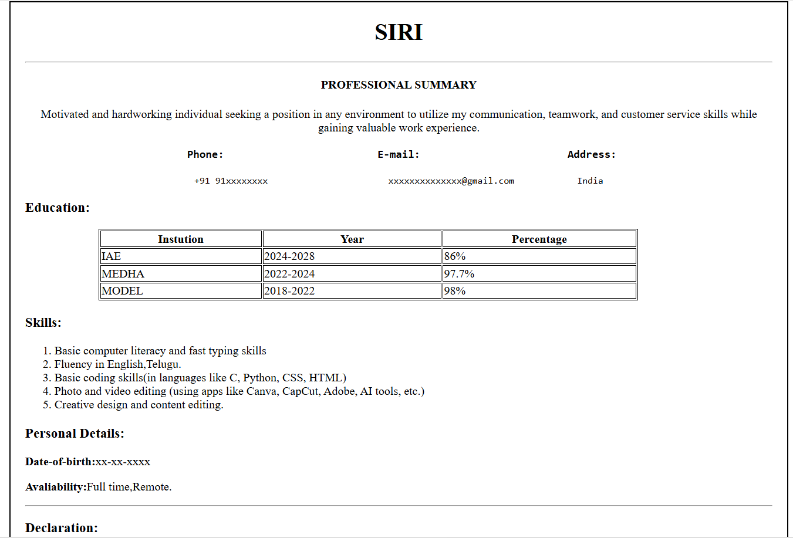

# Personal Portfolio Website

## Overview

This is a simple Personal Portfolio Website created using HTML and CSS. The website introduces me, showcases my skills, and provides access to my resume.

## Features

* Responsive portfolio layout
* Introduction section
* Skills section
* About Me section
* Resume page
* Resume download option
* Clean and simple user interface

## Technologies Used

* HTML5
* CSS3

## Project Structure

```text
portfolio-project/
│
├── index.html      # Portfolio homepage
├── resume.html     # Resume page
├── style.css       # Stylesheet
├── download.webp   # Profile image
└── README.md       # Project documentation
```

## Sections Included

### Home Section

* Portfolio title
* Professional introduction
* Resume navigation button

### Skills Section

* HTML
* CSS
* JavaScript

### About Me Section

* Brief introduction
* Resume download button
* Profile image

### Resume Page

* Professional summary
* Education details
* Skills
* Personal information
* Declaration

## How to Run

1. Download or clone the repository.
2. Open the project folder.
3. Open `index.html` in your web browser.

## Future Improvements

* Make the website fully responsive for mobile devices.
* Add Projects section.
* Add Contact section.
* Add social media links.
* Improve UI with animations and modern design.

## Author

Siri

Frontend Developer passionate about creating clean and user-friendly websites using HTML, CSS, and JavaScript.

## Screenshot of website



## Screenshot of resume



