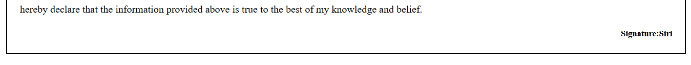

# Resume Webpage

A simple and clean resume webpage created using **HTML** and **CSS**. This project displays personal information, education details, skills, and contact information in a structured resume format.

## Features

* Professional resume layout
* Education details displayed in a table
* Skills section with ordered list
* Contact information section
* Personal details and declaration
* Simple CSS styling with borders and spacing

## Technologies Used

* HTML5
* CSS3

## Project Structure

```
resume-project/
│
├── index.html
└── README.md
```

## Sections Included

* Professional Summary
* Contact Information
* Education
* Skills
* Personal Details
* Declaration

## How to Run

1. Download or clone the repository.
2. Open `index.html` in any web browser.
3. The resume webpage will be displayed.

## Future Improvements

* Add responsive design for mobile devices.
* Improve styling with modern CSS.
* Add profile photo section.
* Include downloadable PDF resume option.

## Author

**Siri**

Created as a beginner HTML and CSS project for practicing webpage structure and styling.

## Screenshot of website


