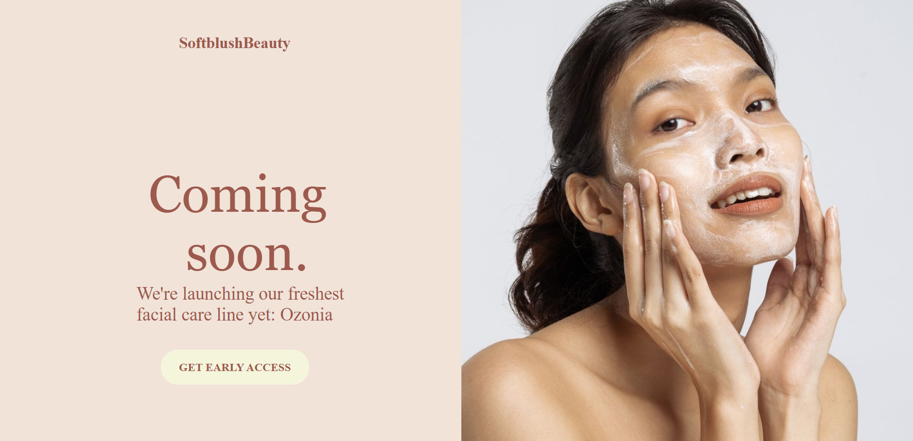
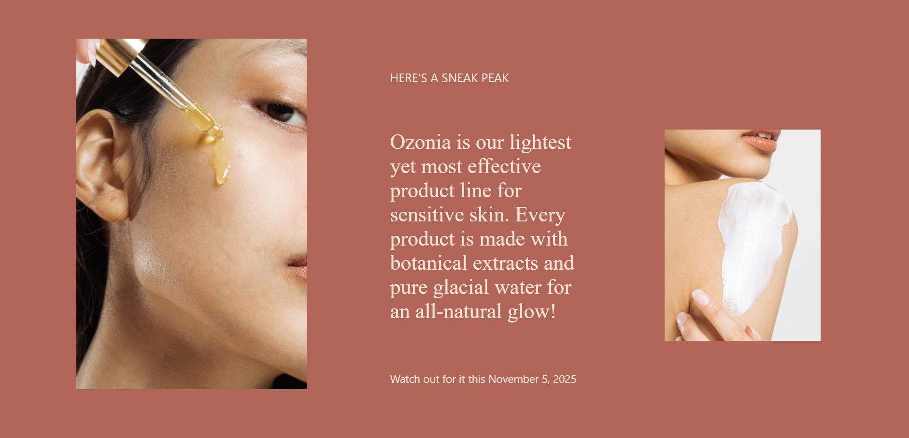
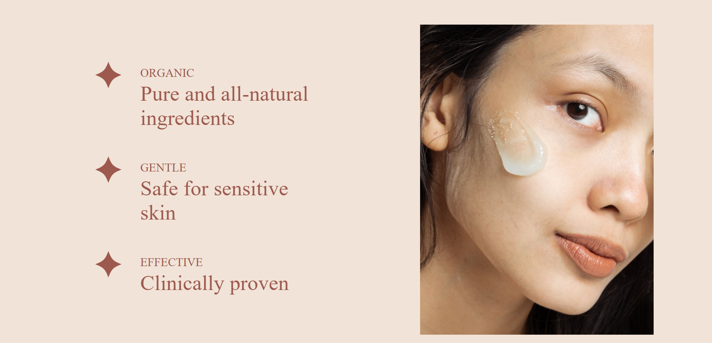
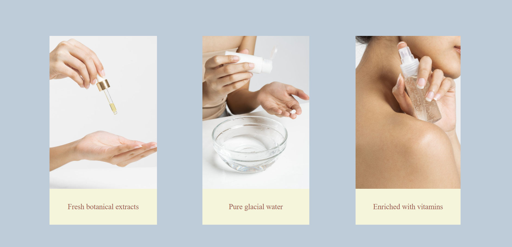
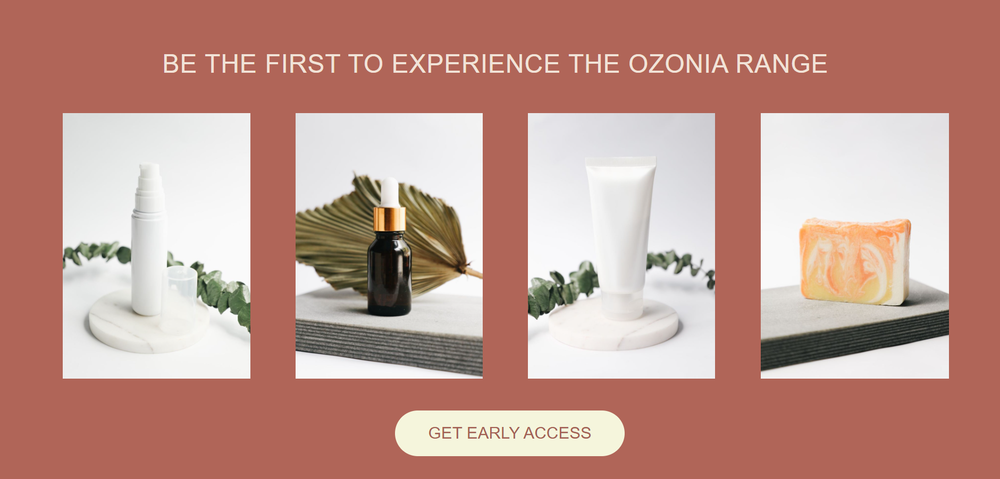
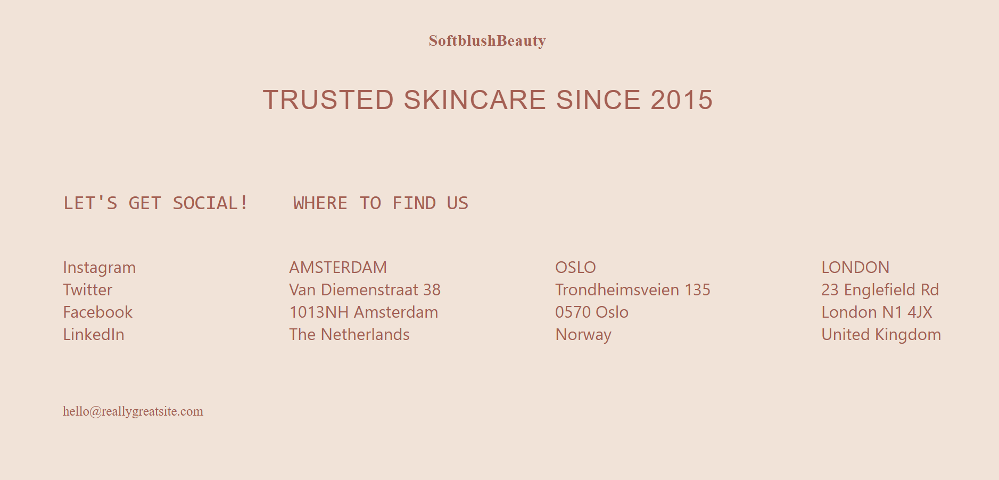

# 🌸 SoftblushBeauty - Coming Soon Landing Page

A modern and elegant skincare product landing page built using **HTML5** and **CSS3**. This project showcases a fictional beauty brand, **SoftblushBeauty**, and promotes the upcoming launch of its new facial care line, **Ozonia**.

## 📸 Project Preview

This landing page includes:

- Hero section with brand introduction
- Product launch announcement
- Product highlights and benefits
- Ingredient showcase
- Product gallery
- Early access call-to-action
- Footer with social media and location details

## 🚀 Features

- Fully designed using HTML and CSS
- Attractive skincare-themed layout
- Multiple content sections
- Custom color palette
- Call-to-action buttons
- Image gallery display
- Responsive viewport settings
- Clean and organized structure

## 🛠️ Technologies Used

- HTML5
- CSS3

## 📂 Project Structure

```text
SoftblushBeauty/
│
├── index.html
├── style.css
├── 1.jpg
├── 2.jpg
├── 3.jpg
├── 4.jpg
├── 5.jpg
├── 6.jpg
├── 7.jpg
├── 8.jpg
├── 9.jpg
├── 10.jpg
└── 11.jpg
```

## 🎨 Color Palette

| Color | Hex Code |
|---------|----------|
| Soft Beige | #f1e3d8 |
| Rose Brown | #b06558 |
| Dark Rose | #9D594D |
| Light Blue | #BECBD8 |
| Cream | beige |

## 📋 Sections Included

### 1. Hero Section
- Brand name
- Coming Soon announcement
- Product introduction
- Early Access button

### 2. Sneak Peek Section
- Product overview
- Launch date information
- Product imagery

### 3. Product Benefits
- ✦ Organic
- ✦ Gentle
- ✦ Effective

### 4. Key Ingredients
- Fresh botanical extracts
- Pure glacial water
- Enriched with vitamins

### 5. Product Gallery
- Featured product images
- Early Access CTA

### 6. Footer
- Company information
- Social media links
- Office locations
- Contact email

## 💡 Learning Outcomes

Through this project, I practiced:

- HTML page structuring
- CSS positioning
- Styling buttons and typography
- Working with images
- Creating multi-section landing pages
- Building aesthetically pleasing UI layouts

## ⚠️ Note

This is a frontend design project created for learning and portfolio purposes. The brand, products, and content are used as sample data.

## 👩‍💻 Author

**Darshwana Allam**

## Screenshots of the website






