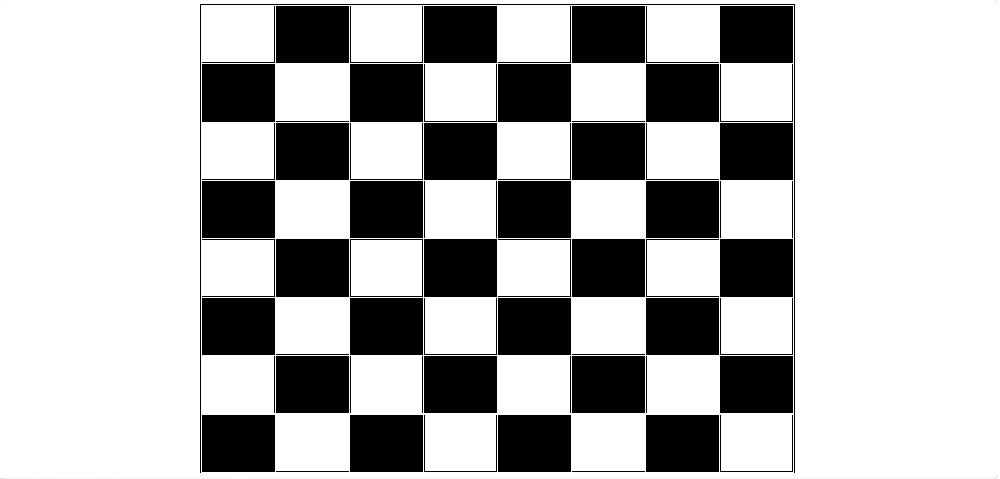

# Chessboard Design Using HTML & CSS

## Overview

This project is a simple Chessboard created using HTML tables and CSS styling. The board consists of an 8×8 grid with alternating black and white squares, replicating the appearance of a standard chessboard.

## Features

* 8×8 chessboard layout
* Alternating black and white squares
* Built using HTML tables
* Styled with CSS
* Beginner-friendly project
* Simple and lightweight design

## Technologies Used

* HTML5
* CSS3

## Project Structure

```text
chessboard-project/
│
├── index.html      # Chessboard structure
├── README.md       # Project documentation
```

## How It Works

### HTML

* Uses a `<table>` element to create an 8×8 grid.
* Each table cell (`<td>`) represents a chessboard square.
* CSS classes are applied to alternate cells for black squares.

### CSS

* Centers the chessboard on the page.
* Adds borders to the table and cells.
* Applies black background colors to alternating squares.

## How to Run

1. Download or clone the repository.
2. Open the project folder.
3. Open `index.html` in your web browser.
4. View the chessboard.

## Learning Outcomes

This project helps beginners understand:

* HTML tables
* Table rows (`<tr>`) and table cells (`<td>`)
* CSS classes
* Background colors
* Page alignment using Flexbox
* Basic web page structure

## Future Improvements

* Add chess pieces using Unicode symbols.
* Improve board sizing for different screen sizes.
* Use CSS Grid instead of tables.
* Add row and column labels (A–H, 1–8).
* Create an interactive chess game using JavaScript.

## Screenshot



## Author

Siri

Frontend Developer passionate about creating web projects using HTML, CSS, and JavaScript.
